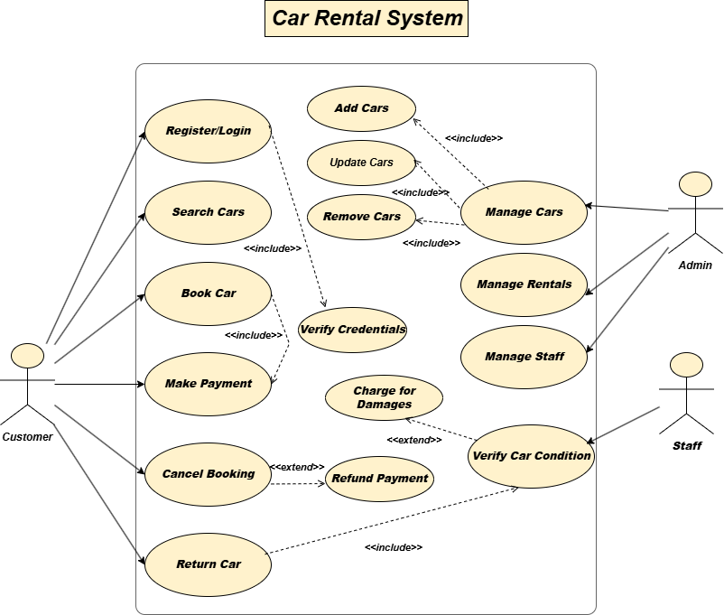
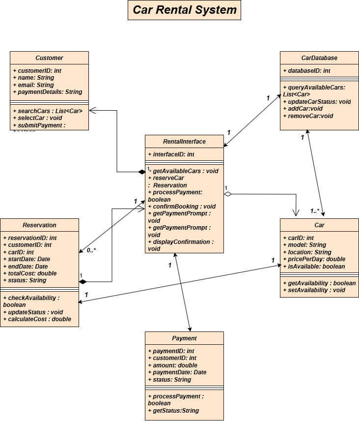
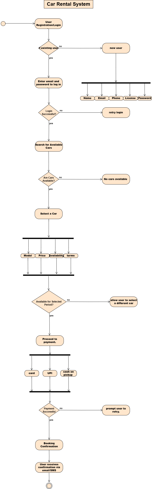
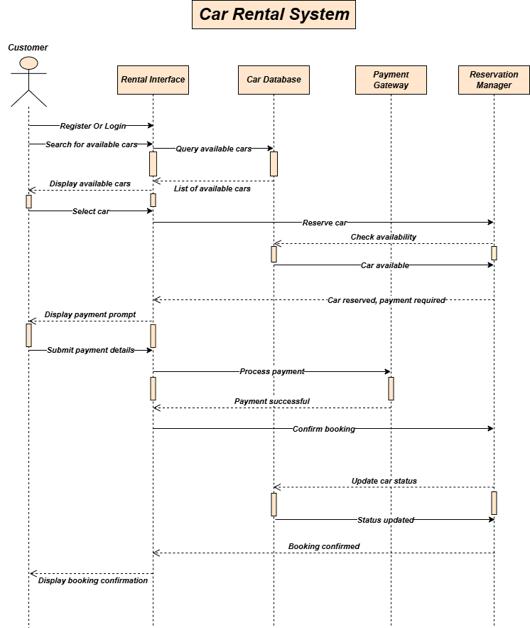
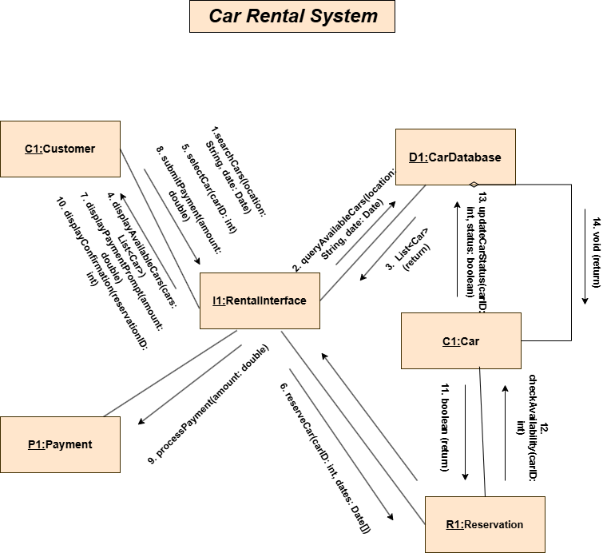

# 🚗 Car Rental System UML Project - 4th Semester

## 📚 About the Project

This project presents the **UML diagrams** for a **Car Rental System**, created as part of the 4th semester coursework.  
The system models the process of renting vehicles, managing users, and handling bookings through well-structured UML diagrams.

The diagrams were developed using **draw.io** (`.drawio` format) for easy viewing, editing, and exporting.

## 🛠️ Tools Used

- [**draw.io**](https://app.diagrams.net/) — for creating and editing UML diagrams.

## 📋 Project Structure

The project contains the following UML diagrams:

| Diagram Type         | Description |
|----------------------|-------------|
| **Use Case Diagram** | Shows how customers and admins interact with the car rental system. |
| **Class Diagram**    | Defines the system's main classes like Car, Customer, Booking, Payment, etc. |
| **Activity Diagram** | Represents the workflow of renting a car from browsing to booking. |
| **Sequence Diagram** | Displays the interaction between a customer, system, and admin during booking. |
| **ER Diagram** *(optional)* | Describes the database tables and relationships if database design is included. |

### 📄 Included File

- `Project UML.drawio` — Main file containing all diagrams.

## 📷 UML Diagrams

### 1. Use Case Diagram

---

### 2. Class Diagram

---

### 3. Activity Diagram

---

### 4. Sequence Diagram

---

### 5. ER Diagram *(Optional)*

---

## 🧑‍💻 How to Open the File

1. Visit [draw.io](https://app.diagrams.net/).
2. Click on **File > Open from Device**.
3. Select and open the `Project UML.drawio` file.
4. You can view, edit, or export the diagrams as needed.

## ✨ Key Features Modeled

- Customer Registration and Login  
- Car Browsing and Selection  
- Booking Process  
- Payment Handling  
- Admin Management (Add/Edit Cars, Manage Bookings)

## 🎯 Objective

- Visualize the working of a Car Rental System using UML.  
- Practice object-oriented design principles.  
- Understand system workflows through modeling.

## 📝 Notes

- UML standards were followed for better clarity.  
- Diagrams can be exported into PDF or PNG formats for documentation or presentations.  
- Project is beginner-friendly and easy to customize for more advanced features.
